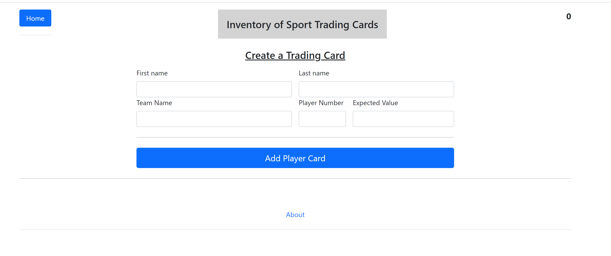
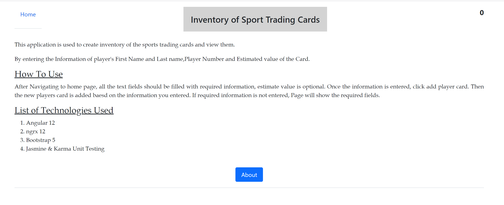
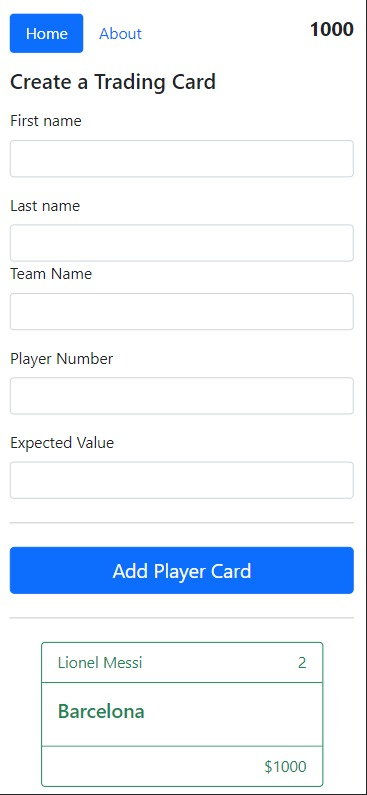
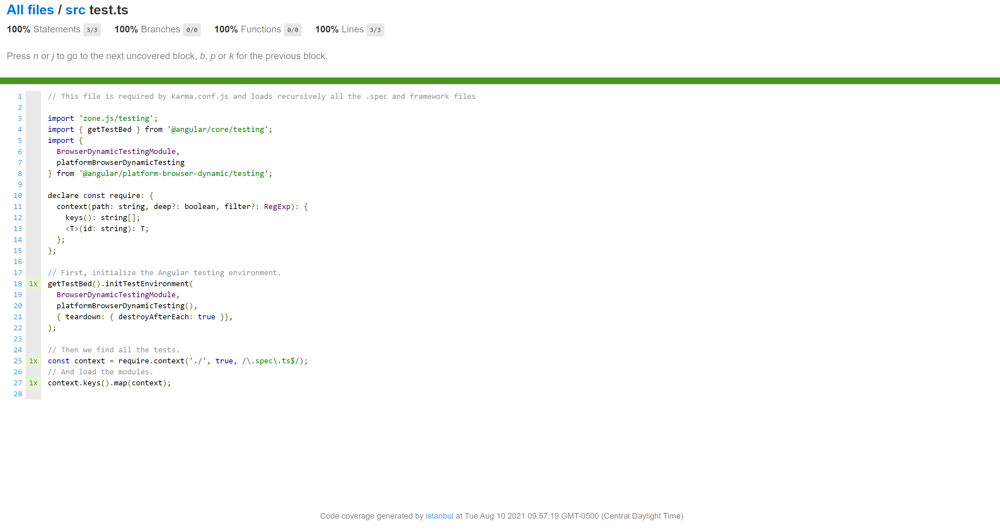

    <!-- <h4><u>About</u></h4> -->
    
This application is used to create inventory of the sports trading cards and view them.

    
By entering the Information of player's First Name and Last name,Player Number and Estimated value of the Card.
    

    <h4><u>How To Use</u></h4>
    
After Navigating to home page, all the text fields should be filled with required information, estimate value is optional. 
      Once the information is entered, click add player card. Then the new players card is added baesd on the information you entered. 
      If required information is not entered, Page will show the required fields.  

    <h4><u>List of Technologies Used</u></h4>
    <ol>
        <li>Angular 12</li>
        <li>ngrx 12</li>
        <li>Bootstrap 5</li>
        <li>Jasmine & Karma Unit Testing</li>
    </ol>
    <h4><u>Screenshots</u></h4>
    <li>Home Page</li>
     
    <li>About</li>
    
    <li>Mobile View</li>
    
    <li>Code Coverage</li>
    

